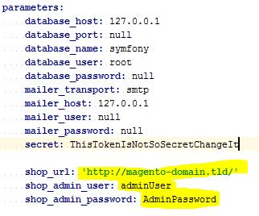

Fancy Frontend Application in PHP (FFAIP) (WIP)
========

Get Symfony started, add magento Host URL in parameters.yml
Add admin user credentials to parameters.yml

Prerequisite

* Magento Installation
* Admins User Credentials
* some Categories
* some Products

Installation

    composer install

    npm install

Configuration

Be sure that shop url, admin user and admin pass are set in parameters.yml:

Starting

After installation is done, simply run:

    php bin/console server:run

Application will be served on http://localhost:8000/

FE tasks:

Compile all javascript

    npm run build

Watch for javascript changes and rebuild stuff

    npm run watch

# Setup with magedev

This is a basic guide, on how to install FFAIP with [Magedev](https://github.com/teamneusta/php-cli-magedev/).

Make sure you have `magedev` installed.

    git clone https://github.com/teamneusta/php-cli-magedev.git && cd php-cli-magedev && git checkout composer-loading
    composer install --no-dev
    ln -s $(pwd)/bin/magedev ~/bin/magedev
    magedev

Suppose we are working in `~/projects`. In fact, some paths are coded into configuration files `setup`.

    git clone https://github.com/magento/magento2.git
    git clone https://github.com/tomtone/FFAIP.git

    cd ~/projects/FFAIP
    cp -R setup/.magedev ~/projects/magento2
    cp setup/magedev.json ~/projects/magento2
    cp setup/parameters.yml app/config

    cd ~/projects/magento2
    git checkout 2.1.8
    magedev docker:start -v
    magedev magento:install
    docker exec magedev-magento2-ffaip bash -c "chmod +x /root/init.sh && /root/init.sh"

    curl http://localhost:8080

# Install Sampledata

docker exec -it magedev-magento2-main bash -c "git clone https://github.com/magento/magento2-sample-data.git /var/www/magento2-sample-data"
docker exec -it magedev-magento2-main bash -c "cd /var/www/magento2-sample-data && git checkout 2.1.8-rc"
docker exec -it magedev-magento2-main bash -c "php -f /var/www/magento2-sample-data/dev/tools/build-sample-data.php -- --ce-source=\"/var/www/html\""
magedev magento:upgrade
